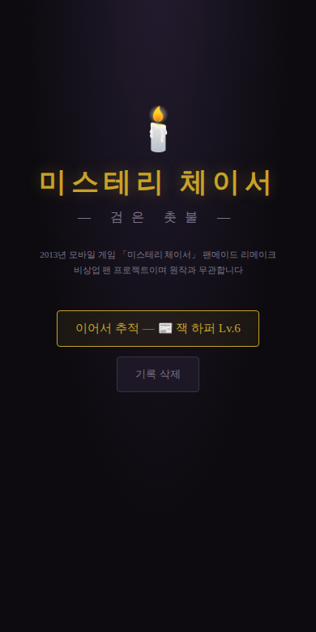
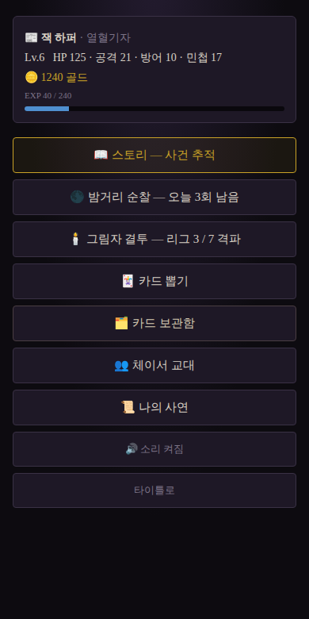
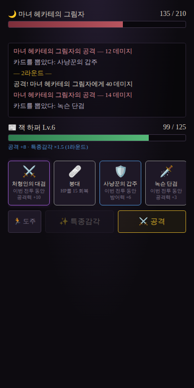
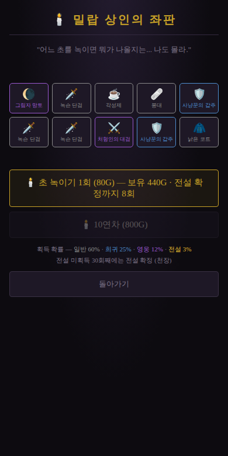
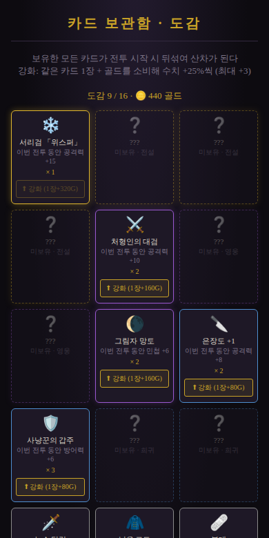
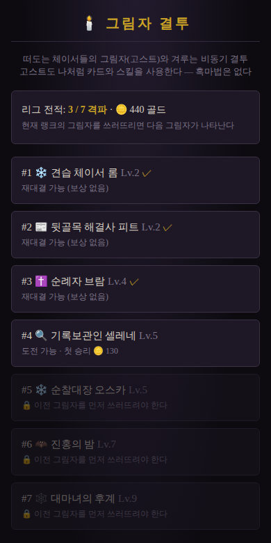

<div align="center">

# 🕯️ 미스테리 체이서: 검은 촛불

**Mystery Chaser: The Black Candle** — 팬메이드 리메이크

2013년 한국 모바일 카드배틀 어드벤처 RPG 「미스테리 체이서」에서 영감을 받은 비상업 팬 게임

   

*설치도, 서버도, 빌드도 필요 없습니다 — `index.html`을 열면 바로 시작됩니다.*

</div>

---

## 📖 소개

비바람에 젖은 19세기풍 항구 도시 **그레이헤이븐**. 시민들이 하나둘 이유 없이 미쳐가고, 그 중심에는 사람의 정신을 잠식하는 흑마법을 연구하는 비밀 결사 **「검은 촛불」**이 있다. 당신은 각자의 이유로 이 사건을 쫓는 추적자, **체이서**가 된다.

원작의 핵심 정체성을 그대로 계승했습니다:

> **"카드는 덱이 아니라 장비다."** — 카드를 사용하면 공격력·방어력·민첩이 오르고, 그 능력치로 공방을 주고받는 원작 고유의 전투 방식. 민첩이 높은 쪽이 선공하고, 캐릭터마다 전투당 1회의 고유 스킬이 있다.

원작의 상표·일러스트·텍스트는 일절 사용하지 않았으며, 시스템과 분위기를 재해석한 오리지널 콘텐츠입니다.

## 📸 스크린샷

| 타이틀 | 허브 | 전투 |
|:---:|:---:|:---:|
|  |  |  |

| 카드 뽑기 (10연차) | 보관함 · 도감 · 강화 | 그림자 결투 (PvP) |
|:---:|:---:|:---:|
|  |  |  |

## 🚀 시작하기

```bash
git clone <this-repo> && cd Mystery-Chaser

# 방법 1 — 그냥 열기
#   index.html 을 브라우저로 열면 끝

# 방법 2 — 로컬 서버 (권장)
npx serve .
# 또는
python3 -m http.server 8000
```

- 📱 모바일 세로 화면(360px~)에 최적화, 데스크톱도 지원
- 💾 진행 상황은 브라우저 localStorage에 자동 저장 (구버전 세이브는 자동 마이그레이션)
- 🌐 외부 요청 0건 — 오프라인에서도 완전 동작 (사운드까지 WebAudio 실시간 합성)

## ⚔️ 주요 기능

### 전투 — 원작식 "장비형 카드배틀"
- 보유 카드 전체가 섞여 **산차(deck)**가 되고, 매 라운드 1장을 사용해 능력치를 쌓는다
- **민첩 = 선공 + 회피**: 민첩 우위만큼 회피율(최대 30%)이 붙는다
- 적은 4라운드마다 방어 무시 **흑마법**을 쓴다 — 장기전은 위험하다
- 고유 스킬은 전투당 1회. 언제 쓰느냐가 승부를 가른다
- 불리하면 **도주** 가능 (페널티 없음)

### 플레이어블 체이서 6인
| 체이서 | 아키타입 | 고유 스킬 | 해금 |
|---|---|---|---|
| ❄️ 에드윈 프로스트 · 얼음의 귀공자 | 컨트롤 탱커 | **절대영도** — 적 공격력 30% 감소 (지속) | 기본 |
| ✝️ 그레고르 신부 · 광기의 사제 | 서스테인 탱커 | **광신의 기도** — 최대 HP 40% 회복 | 기본 |
| 🔍 아리아 벨 · 천재소녀 | 테크니컬 딜러 | **완전분석** — 2드로우 + 관통 일격 ×2 | 기본 |
| 📰 잭 하퍼 · 열혈기자 | 스피드 딜러 | **특종감각** — 3라운드 공격력 ×1.5 | 기본 |
| 🦇 비올레타 · 심야의 후원자 | 흡혈 브루저 | **갈증** — 공격 데미지 20% 흡혈 (지속) | 3장 클리어 |
| 🕸️ 마고 · 파문당한 견습 마녀 | 저주 캐스터 | **파멸의 저주** — 적 방어력 50% 감소 (지속) | 5장 클리어 |

캐릭터는 허브에서 언제든 **교대** 가능하며, 레벨·골드·카드는 계정 공유. 각자 개인 사연(서브 스토리)을 갖고 있다.

### 콘텐츠
- **📖 메인 스토리 5챕터** — 부둣가의 광인부터 대성당 첨탑의 흑막까지. 클리어한 챕터는 스토리 스킵 + 무제한 재도전(보상 50%)
- **🌑 일일 던전 「밤거리 순찰」** — 하루 3회, 내 레벨에 맞춰 강해지는 적. 골드·경험치·카드 파밍의 축
- **🕯️ 그림자 결투 (서버 없는 비동기 PvP)** —
  - **고스트 리그**: 나처럼 카드와 스킬을 쓰는 NPC 고스트 7인 사다리. 전원 격파 시 칭호 「밤의 챔피언」
  - **친선전**: 내 빌드를 **고스트 코드**로 복사해 친구에게 전송 — 친구가 붙여넣으면 내 고스트와 대전
- **🃏 카드 뽑기** — 4등급 16종, 확률 상시 공시(60/25/12/3%), **30회 천장**, 10연차. 재화는 인게임 골드뿐, 실과금 없음
- **⬆️ 카드 강화** — 중복 카드 1장 + 골드를 태워 +3까지 강화(수치 ×1.75). 산차가 얇아지는 트레이드오프
- **📚 도감** — 미보유 카드 실루엣과 수집 진척 표시

## 🎲 설계 철학: 시뮬레이션 기반 밸런싱

모든 규칙과 수치는 **감이 아니라 시뮬레이션**으로 정했습니다. 전투 공식을 그대로 구현한 시뮬레이터로 캐릭터×챕터당 5,000회 전투를 돌려 목표 승률 밴드를 검증한 뒤에만 기획서와 코드에 반영합니다.

```bash
node tools/balance-sim.js   # PvE: 챕터·던전 승률 검증
node tools/pvp-sim.js       # PvP: 리그 사다리 난이도 검증
```

> 예: 초기 수치는 전 구간 승률 100%(난이도 부재)였고, 적을 강화하자 5챕터 승률이 에드윈 100% vs 아리아 0%로 갈라졌다. 회피 규칙 신설과 스킬 리워크를 시뮬레이션으로 검증해 최종 60~100% 밴드로 수렴시켰다 — 전 과정이 [기획서 §7](docs/FEATURE_SPEC.md)에 기록되어 있다.

**변경 관리 원칙**: 기획서 수정 → 시뮬레이션 재검증 → 코드 반영. 기획서 표와 코드가 어긋난 채로 머지 금지.

## 📂 프로젝트 구조

```
Mystery-Chaser/
├── index.html            # 진입점 (빌드 불필요)
├── css/style.css         # 다크 고딕 테마
├── js/
│   ├── data.js           # 캐릭터·카드·챕터·던전·리그 데이터 (밸런스 수치)
│   ├── game.js           # 게임 로직 (전투·성장·경제·저장·PvP)
│   └── sound.js          # WebAudio 합성 SFX (외부 에셋 0)
├── tools/
│   ├── balance-sim.js    # PvE 밸런스 시뮬레이터
│   └── pvp-sim.js        # PvP 사다리 시뮬레이터
└── docs/
    ├── FEATURE_SPEC.md   # ⭐ 기능 기획서 — 규칙·수치의 단일 기준
    ├── GDD.md            # 세계관·콘셉트 개요 (원작 조사 포함)
    └── screenshots/
```

## 🗺️ 버전 히스토리

| 버전 | 내용 |
|---|---|
| v0.1 | 프로토타입: 코어 루프 (캐릭터·스토리·전투·뽑기·저장) |
| v0.2 | 시뮬레이션 기반 밸런스 확립: 회피 규칙, 스킬 리워크, 난이도 곡선 |
| v0.3 | 카드 강화, 뽑기 천장, 도감, 적 회피 대칭 |
| v0.4 | 일일 던전, 캐릭터 2인 추가·교대, WebAudio 사운드 |
| v0.5 | 그림자 결투: 고스트 리그 + 친선전 고스트 코드 (서버 없는 PvP) |
| v0.6 | 플레이테스트 개선: 도주, 스토리 스킵, 확률 공시·10연차, 이어하기 |
| 백로그 | 정식 일러스트, 스토리 2부, 온라인 랭킹 |

## ⚖️ 고지

- 본 프로젝트는 **비상업 팬메이드 게임**이며 원작 「미스테리 체이서」 및 그 권리자와 무관합니다
- 원작의 에셋(일러스트·음원·텍스트)을 일절 사용하지 않았으며, 캐릭터·지명·스토리는 원작의 "유형"만 참고한 오리지널 창작물입니다
- 원작 권리자의 요청이 있을 경우 즉시 조치합니다
